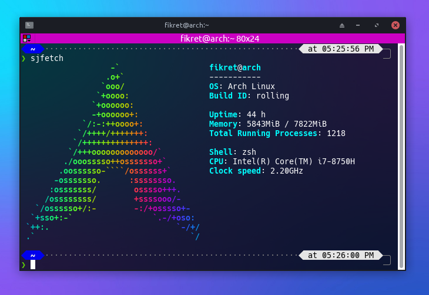
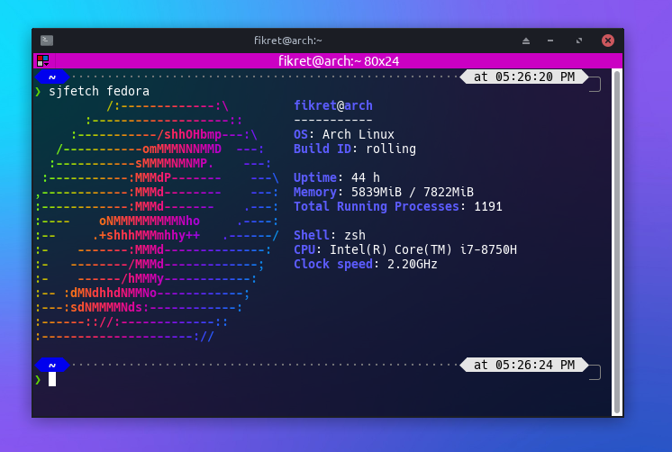
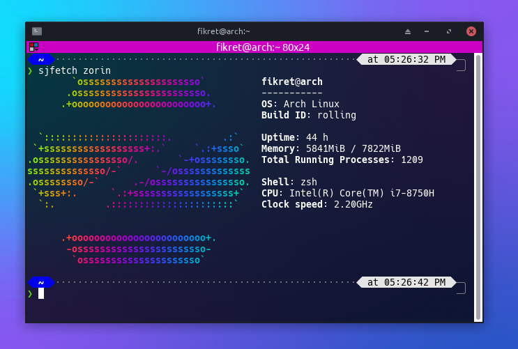

# sjfetch
A command-line tool to display colorful distro information.

## Install
```
git clone https://github.com/fikret0/sjfetch.git
cd sjfetch

chmod +x install.sh
sudo ./install.sh
```

**or**

```
curl -sL "https://raw.githubusercontent.com/fikret0/sjfetch/main/netinstall.sh" | sudo sh
```

## Screenshots





**sj.**