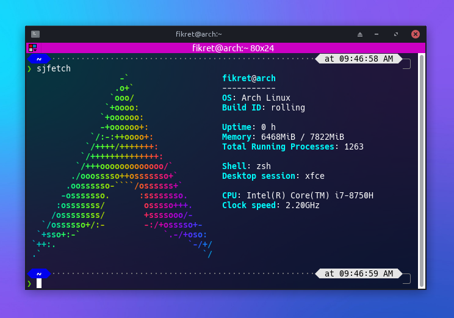

# sjfetch
A command-line tool to display colorful distro information.

## Install
```
git clone https://github.com/fikret0/sjfetch.git
cd sjfetch

chmod +x install.sh
sudo ./install.sh
```

**or**

```
sudo sh -c "$(curl -fsSL https://raw.githubusercontent.com/fikret0/sjfetch/main/netinstall.sh)"
```

## Screenshots


### [More Screenshots](assets/screenshots)

nOTE: **CONTRIBUTE MORE ASCII LOGOS!!1!!!!11!**
